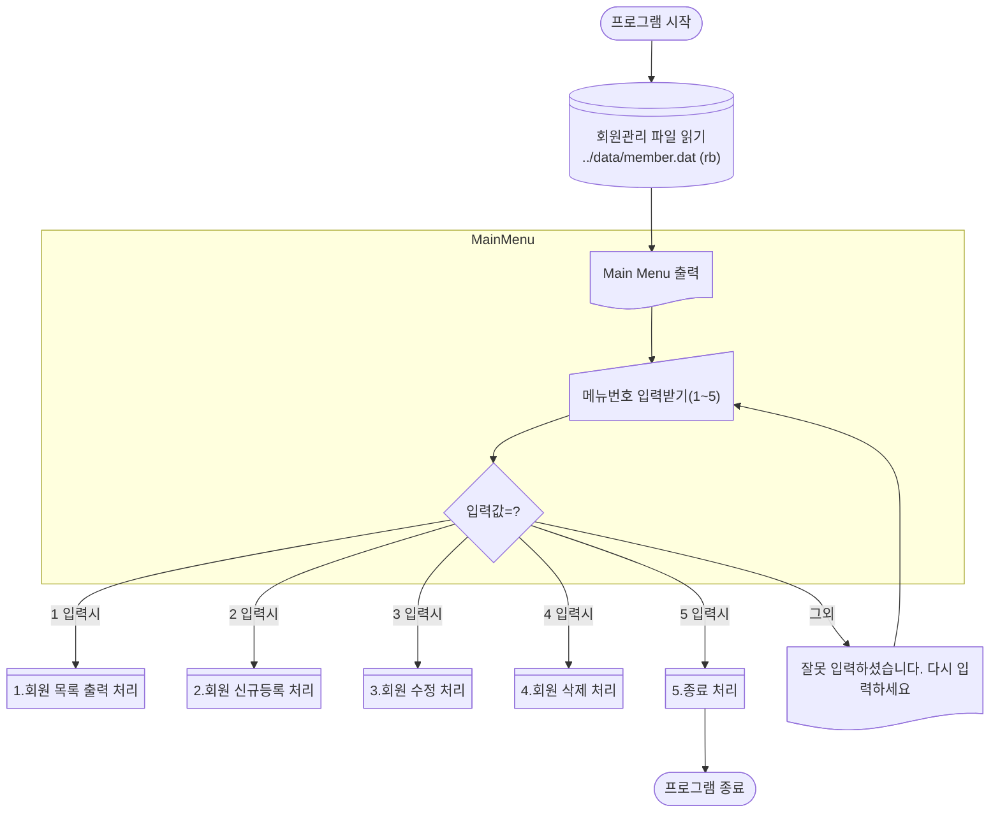

# 회원 관리 프로그램 플로우차트 
### 회원관리의 PK 는 전화번호 : Not Null, Unique

```mermaid
graph TD
    %% 프로그램 시작 및 메뉴
    start([프로그램 시작]) --> readFile@{ shape: lin-cyl, label: "회원관리 파일 읽기 <br> ../data/member.dat (rb)"};
    readFile --> MainMenu
    subgraph MainMenu    
        MainMenu@{ shape: doc, label: "Main Menu 출력"} --> MenuNo@{ shape: manual-input, label: "메뉴번호 입력받기(1~5)" }
        MenuNo --> MenuNoValidation{입력값=?}
    end        
    MenuNoValidation -- 1 입력시 --> List@{ shape: div-rect, label: "1.회원 목록 출력 처리"};
    MenuNoValidation -- 2 입력시 --> Add@{ shape: div-rect, label: "2.회원 신규등록 처리"};
    MenuNoValidation -- 3 입력시 --> Update@{ shape: div-rect, label: "3.회원 수정 처리"};
    MenuNoValidation -- 4 입력시 --> Remove@{ shape: div-rect, label: "4.회원 삭제 처리"};
    MenuNoValidation -- 5 입력시 --> Finish@{ shape: div-rect, label: "5.종료 처리"};
        Finish --> END([프로그램 종료])
    MenuNoValidation --> | 그외 | errorInputPrint@{ shape: doc, label: "잘못 입력하셨습니다. 다시 입력하세요"};
    errorInputPrint --> MenuNo
```