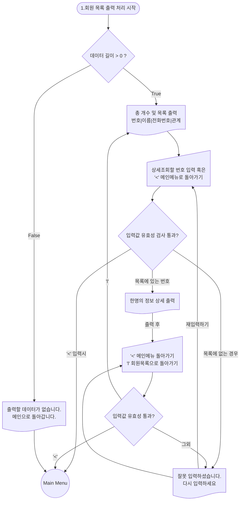

## 회원 관리 프로그램 플로우차트 : 목록 출력 

```mermaid
graph TD
    %% 회원 목록 출력
    List([1.회원 목록 출력 처리 시작]) --> getList{ 데이터 길이 > 0 ? }    
    getList -- True --> printList@{ shape: doc, label: "총 개수 및 목록 출력<br>번호|이름|전화번호|관계"};
        printList --> inputViewNum@{ shape: sl-rect, label: "상세조회할 번호 입력 혹은 <br> '<' 메인메뉴로 돌아가기" };
        inputViewNum --> inputValidation{ 입력값 유효성 검사 통과? }
        inputValidation -- '<' 입력시 --> mainMenu((Main Menu));
        inputValidation -- 목록에 있는 번호 --> viewDetail@{ shape: doc, label: "한명의 정보 상세 출력"}
        inputValidation -- 목록에 없는 경우 --> errorInputPrint@{ shape: doc, label: "잘못 입력하셨습니다.<br> 다시 입력하세요"};
        errorInputPrint -- 재입력하기 --> inputViewNum
        viewDetail -- 출력 후 --> nextAction@{ shape: sl-rect, label: "'<' 메인메뉴 돌아가기 <br> 'l' 회원목록으로 돌아가기" }
        nextAction --> validation{입력값 유효성 통과? }
        validation -- '<' --> mainMenu
        validation -- 'l' --> printList
        validation -- 그외 --> errorInputPrint@{ shape: doc, label: "잘못 입력하셨습니다. <br> 다시 입력하세요"};
        errorInputPrint --> nextAction
    getList -- False --> noData@{ shape: doc, label: "출력할 데이터가 없습니다. <br>메인으로 돌아갑니다. " }
    noData --> mainMenu
```
 