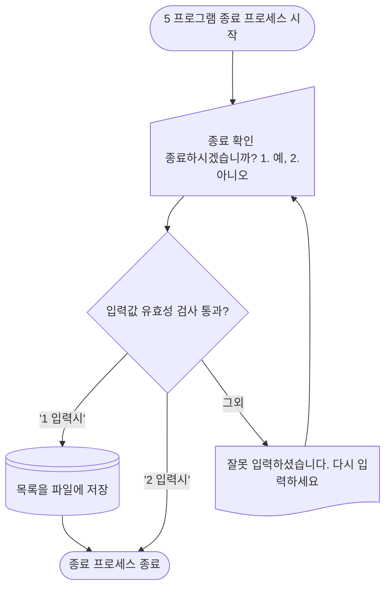

## 회원 관리 프로그램 플로우차트 종료 

```mermaid
graph TD
    %% 프로그램 종료
    finish([5 프로그램 종료 프로세스 시작]); 
    finish --> finishConfirm@{ shape: sl-rect, label: "종료 확인 <br> 종료하시겠습니까? 1. 예, 2. 아니오"};
    finishConfirm --> finishValidation{ 입력값 유효성 검사 통과? };
    finishValidation -- '1 입력시' --> finishProcess@{ shape: lin-cyl, label: " 목록을 파일에 저장"} --> END ;
    finishValidation -- '2 입력시' --> END([종료 프로세스 종료]); 
    finishValidation -- 그외 --> inputErrorPrint@{ shape: doc, label: "잘못 입력하셨습니다. 다시 입력하세요"};
    inputErrorPrint --> finishConfirm
    
```