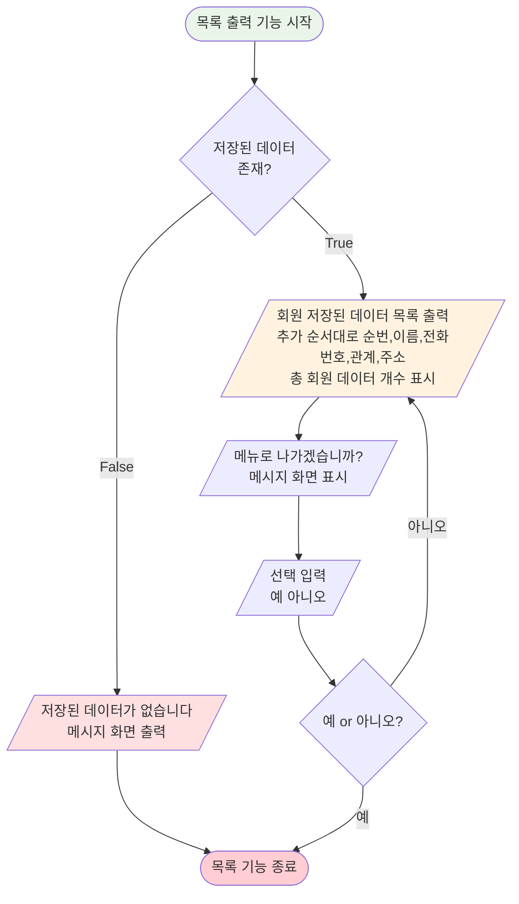

```mermaid
flowchart TD
    LIST_START([목록 출력 기능 시작]) --> LIST_DATA_CHK{저장된 데이터<br/>존재?}
    LIST_DATA_CHK -->|False| LIST_NO_DATA[/"저장된 데이터가 없습니다<br/>메시지 화면 출력"/]
    LIST_NO_DATA --> LIST_END([목록 기능 종료])
    
    LIST_DATA_CHK -->|True| LIST_DISPLAY[/"회원 저장된 데이터 목록 출력<br/>추가 순서대로 순번,이름,전화번호,관계,주소<br/>총 회원 데이터 개수 표시"/]
    
    LIST_DISPLAY --> LIST_EXIT_MSG[/"메뉴로 나가겠습니까?<br/>메시지 화면 표시"/]
    LIST_EXIT_MSG --> LIST_EXIT_INPUT[/선택 입력<br/>예 아니오/]
    LIST_EXIT_INPUT --> LIST_EXIT_CHOICE{예 or 아니오?}
    
    LIST_EXIT_CHOICE -->|예| LIST_END
    LIST_EXIT_CHOICE -->|아니오| LIST_DISPLAY
    
    style LIST_START fill:#e8f5e8
    style LIST_END fill:#ffcdd2
    style LIST_DISPLAY fill:#fff3e0
    style LIST_NO_DATA fill:#ffe0e0
```