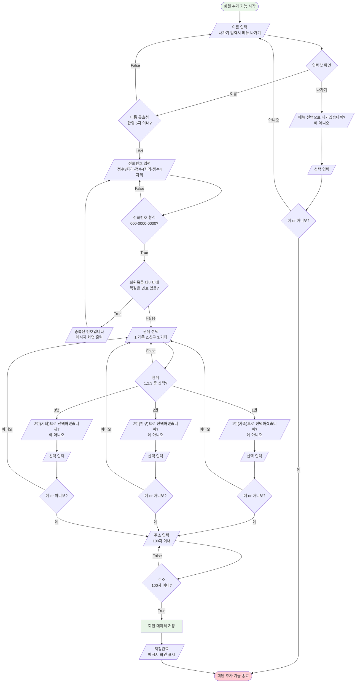

```mermaid
flowchart TD
    ADD_START([회원 추가 기능 시작]) --> ADD_NAME[/이름 입력<br/>나가기 입력시 메뉴 나가기/]
    ADD_NAME --> ADD_NAME_CHK{입력값 확인}
    ADD_NAME_CHK -->|나가기| ADD_EXIT_CONFIRM[/"메뉴 선택으로 나가겠습니까?<br/>예 아니오"/]
    ADD_EXIT_CONFIRM --> ADD_EXIT_INPUT[/선택 입력/]
    ADD_EXIT_INPUT --> ADD_EXIT_CHOICE{예 or 아니오?}
    ADD_EXIT_CHOICE -->|아니오| ADD_NAME
    ADD_EXIT_CHOICE -->|예| ADD_END([회원 추가 기능 종료])
    
    ADD_NAME_CHK -->|이름| ADD_NAME_VALID{이름 유효성<br/>한영 5자 이내?}
    ADD_NAME_VALID -->|False| ADD_NAME
    ADD_NAME_VALID -->|True| ADD_PHONE[/전화번호 입력<br/>정수3자리-정수4자리-정수4자리/]
    
    ADD_PHONE --> ADD_PHONE_FORMAT{전화번호 형식<br/>000-0000-0000?}
    ADD_PHONE_FORMAT -->|False| ADD_PHONE
    ADD_PHONE_FORMAT -->|True| ADD_DUP_CHK{회원목록 데이터에<br/>똑같은 번호 있음?}
    
    ADD_DUP_CHK -->|True| ADD_DUP_MSG[/"중복된 번호입니다<br/>메시지 화면 출력"/]
    ADD_DUP_MSG --> ADD_PHONE
    ADD_DUP_CHK -->|False| ADD_REL[/관계 선택<br/>1.가족 2.친구 3.기타/]
    
    ADD_REL --> ADD_REL_CHK{관계<br/>1,2,3 중 선택?}
    ADD_REL_CHK -->|False| ADD_REL
    
    ADD_REL_CHK -->|1번| ADD_REL_1_CONFIRM[/"1번(가족)으로 선택하겠습니까?<br/>예 아니오"/]
    ADD_REL_1_CONFIRM --> ADD_REL_1_INPUT[/선택 입력/]
    ADD_REL_1_INPUT --> ADD_REL_1_CHOICE{예 or 아니오?}
    ADD_REL_1_CHOICE -->|아니오| ADD_REL
    ADD_REL_1_CHOICE -->|예| ADD_ADDR[/주소 입력<br/>100자 이내/]
    
    ADD_REL_CHK -->|2번| ADD_REL_2_CONFIRM[/"2번(친구)으로 선택하겠습니까?<br/>예 아니오"/]
    ADD_REL_2_CONFIRM --> ADD_REL_2_INPUT[/선택 입력/]
    ADD_REL_2_INPUT --> ADD_REL_2_CHOICE{예 or 아니오?}
    ADD_REL_2_CHOICE -->|아니오| ADD_REL
    ADD_REL_2_CHOICE -->|예| ADD_ADDR
    
    ADD_REL_CHK -->|3번| ADD_REL_3_CONFIRM[/"3번(기타)으로 선택하겠습니까?<br/>예 아니오"/]
    ADD_REL_3_CONFIRM --> ADD_REL_3_INPUT[/선택 입력/]
    ADD_REL_3_INPUT --> ADD_REL_3_CHOICE{예 or 아니오?}
    ADD_REL_3_CHOICE -->|아니오| ADD_REL
    ADD_REL_3_CHOICE -->|예| ADD_ADDR
    
    ADD_ADDR --> ADD_ADDR_CHK{주소<br/>100자 이내?}
    ADD_ADDR_CHK -->|False| ADD_ADDR
    ADD_ADDR_CHK -->|True| ADD_SAVE[회원 데이터 저장]
    ADD_SAVE --> ADD_COMPLETE[/"저장완료<br/>메시지 화면 표시"/]
    ADD_COMPLETE --> ADD_END
    
    style ADD_START fill:#e8f5e8
    style ADD_END fill:#ffcdd2
    style ADD_SAVE fill:#e8f5e8
```