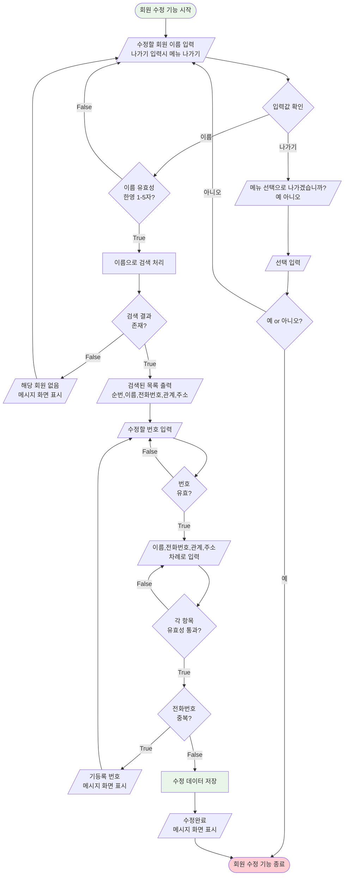

```mermaid
flowchart TD
    EDIT_START([회원 수정 기능 시작]) --> EDIT_NAME[/수정할 회원 이름 입력<br/>나가기 입력시 메뉴 나가기/]
    EDIT_NAME --> EDIT_NAME_CHK{입력값 확인}
    EDIT_NAME_CHK -->|나가기| EDIT_EXIT_CONFIRM[/"메뉴 선택으로 나가겠습니까?<br/>예 아니오"/]
    EDIT_EXIT_CONFIRM --> EDIT_EXIT_INPUT[/선택 입력/]
    EDIT_EXIT_INPUT --> EDIT_EXIT_CHOICE{예 or 아니오?}
    EDIT_EXIT_CHOICE -->|아니오| EDIT_NAME
    EDIT_EXIT_CHOICE -->|예| EDIT_END([회원 수정 기능 종료])
    
    EDIT_NAME_CHK -->|이름| EDIT_NAME_VALID{이름 유효성<br/>한영 1-5자?}
    EDIT_NAME_VALID -->|False| EDIT_NAME
    EDIT_NAME_VALID -->|True| EDIT_SEARCH[이름으로 검색 처리]
    
    EDIT_SEARCH --> EDIT_FOUND{검색 결과<br/>존재?}
    EDIT_FOUND -->|False| EDIT_NOT_FOUND[/"해당 회원 없음<br/>메시지 화면 표시"/]
    EDIT_NOT_FOUND --> EDIT_NAME
    
    EDIT_FOUND -->|True| EDIT_LIST[/"검색된 목록 출력<br/>순번,이름,전화번호,관계,주소"/]
    EDIT_LIST --> EDIT_SELECT[/수정할 번호 입력/]
    EDIT_SELECT --> EDIT_NUM_CHK{번호<br/>유효?}
    EDIT_NUM_CHK -->|False| EDIT_SELECT
    
    EDIT_NUM_CHK -->|True| EDIT_INPUT[/이름,전화번호,관계,주소<br/>차례로 입력/]
    EDIT_INPUT --> EDIT_VALID{각 항목<br/>유효성 통과?}
    EDIT_VALID -->|False| EDIT_INPUT
    EDIT_VALID -->|True| EDIT_DUP_CHK{전화번호<br/>중복?}
    
    EDIT_DUP_CHK -->|True| EDIT_DUP_MSG[/"기등록 번호<br/>메시지 화면 표시"/]
    EDIT_DUP_MSG --> EDIT_SELECT
    EDIT_DUP_CHK -->|False| EDIT_SAVE[수정 데이터 저장]
    EDIT_SAVE --> EDIT_COMPLETE[/"수정완료<br/>메시지 화면 표시"/]
    EDIT_COMPLETE --> EDIT_END
    
    style EDIT_START fill:#e8f5e8
    style EDIT_END fill:#ffcdd2
    style EDIT_SAVE fill:#e8f5e8
```