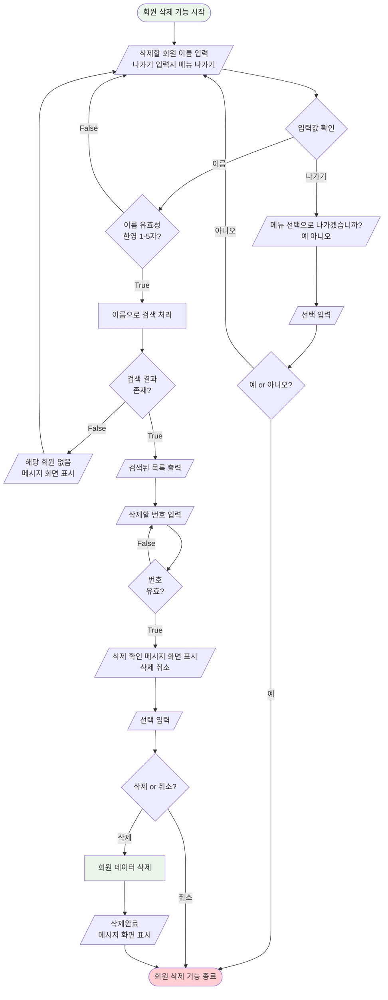

```mermaid
flowchart TD
    DEL_START([회원 삭제 기능 시작]) --> DEL_NAME[/삭제할 회원 이름 입력<br/>나가기 입력시 메뉴 나가기/]
    DEL_NAME --> DEL_NAME_CHK{입력값 확인}
    DEL_NAME_CHK -->|나가기| DEL_EXIT_CONFIRM[/"메뉴 선택으로 나가겠습니까?<br/>예 아니오"/]
    DEL_EXIT_CONFIRM --> DEL_EXIT_INPUT[/선택 입력/]
    DEL_EXIT_INPUT --> DEL_EXIT_CHOICE{예 or 아니오?}
    DEL_EXIT_CHOICE -->|아니오| DEL_NAME
    DEL_EXIT_CHOICE -->|예| DEL_END([회원 삭제 기능 종료])
    
    DEL_NAME_CHK -->|이름| DEL_NAME_VALID{이름 유효성<br/>한영 1-5자?}
    DEL_NAME_VALID -->|False| DEL_NAME
    DEL_NAME_VALID -->|True| DEL_SEARCH[이름으로 검색 처리]
    
    DEL_SEARCH --> DEL_FOUND{검색 결과<br/>존재?}
    DEL_FOUND -->|False| DEL_NOT_FOUND[/"해당 회원 없음<br/>메시지 화면 표시"/]
    DEL_NOT_FOUND --> DEL_NAME
    
    DEL_FOUND -->|True| DEL_LIST[/"검색된 목록 출력"/]
    DEL_LIST --> DEL_SELECT[/삭제할 번호 입력/]
    DEL_SELECT --> DEL_NUM_CHK{번호<br/>유효?}
    DEL_NUM_CHK -->|False| DEL_SELECT
    
    DEL_NUM_CHK -->|True| DEL_CONFIRM[/"삭제 확인 메시지 화면 표시<br/>삭제 취소"/]
    DEL_CONFIRM --> DEL_INPUT[/선택 입력/]
    DEL_INPUT --> DEL_CHOICE{삭제 or 취소?}
    
    DEL_CHOICE -->|취소| DEL_END
    DEL_CHOICE -->|삭제| DEL_EXECUTE[회원 데이터 삭제]
    DEL_EXECUTE --> DEL_COMPLETE[/"삭제완료<br/>메시지 화면 표시"/]
    DEL_COMPLETE --> DEL_END
    
    style DEL_START fill:#e8f5e8
    style DEL_END fill:#ffcdd2
    style DEL_EXECUTE fill:#e8f5e8
```