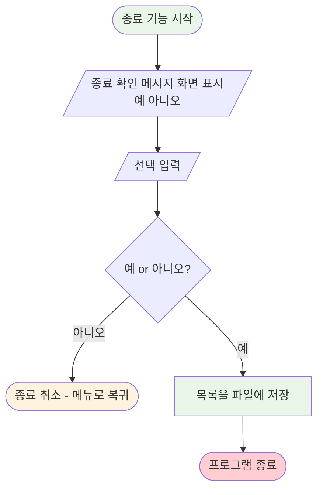

```mermaid
flowchart TD
    EXIT_START([종료 기능 시작]) --> EXIT_CONFIRM[/"종료 확인 메시지 화면 표시<br/>예 아니오"/]
    EXIT_CONFIRM --> EXIT_INPUT[/선택 입력/]
    EXIT_INPUT --> EXIT_CHOICE{예 or 아니오?}
    
    EXIT_CHOICE -->|아니오| EXIT_CANCEL([종료 취소 - 메뉴로 복귀])
    EXIT_CHOICE -->|예| SAVE_FILE[목록을 파일에 저장]
    SAVE_FILE --> EXIT_END([프로그램 종료])
    
    style EXIT_START fill:#e8f5e8
    style EXIT_END fill:#ffcdd2
    style EXIT_CANCEL fill:#fff3e0
    style SAVE_FILE fill:#e8f5e8
```