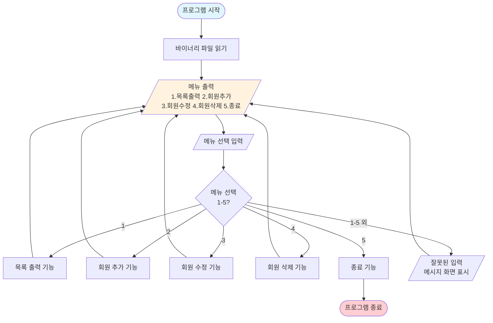

```mermaid
flowchart TD
    START([프로그램 시작]) --> LOAD[바이너리 파일 읽기]
    LOAD --> MENU[/"메뉴 출력<br/>1.목록출력 2.회원추가<br/>3.회원수정 4.회원삭제 5.종료"/]
    
    MENU --> CHOICE[/메뉴 선택 입력/]
    CHOICE --> SELECT{메뉴 선택<br/>1-5?}
    
    SELECT -->|1| LIST_FUNC[목록 출력 기능]
    SELECT -->|2| ADD_FUNC[회원 추가 기능]
    SELECT -->|3| EDIT_FUNC[회원 수정 기능]
    SELECT -->|4| DELETE_FUNC[회원 삭제 기능]
    SELECT -->|5| EXIT_FUNC[종료 기능]
    SELECT -->|1-5 외| INVALID[/"잘못된 입력<br/>메시지 화면 표시"/]
    
    LIST_FUNC --> MENU
    ADD_FUNC --> MENU
    EDIT_FUNC --> MENU
    DELETE_FUNC --> MENU
    EXIT_FUNC --> END([프로그램 종료])
    INVALID --> MENU
    
    style START fill:#e1f5fe
    style END fill:#ffcdd2
    style MENU fill:#fff3e0
```