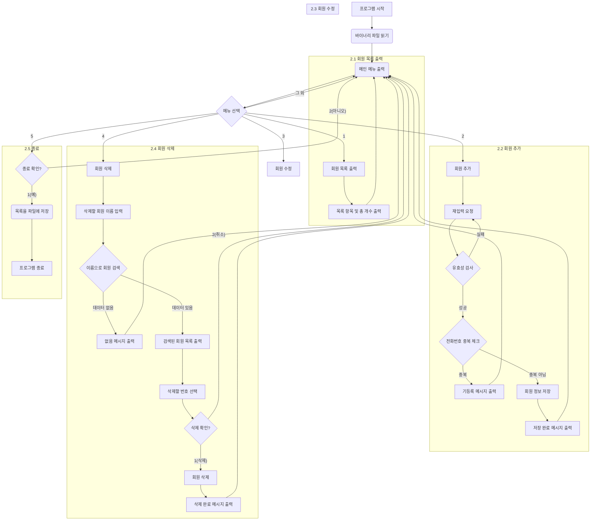

# 회원 관리 프로그램 플로우차트

```mermaid
graph TD
    %% 프로그램 시작 및 메뉴
    A[프로그램 시작] --> B(바이너리 파일 읽기);
    B --> C(메인 메뉴 출력);
    C --> D{메뉴 선택};
    D -- 1 --> E[회원 목록 출력];
    D -- 2 --> F[회원 추가];
    D -- 3 --> G[회원 수정];
    D -- 4 --> H[회원 삭제];
    D -- 5 --> I{종료 확인?};
    D -- 그 외 --> C;

    %% 2.1 회원 목록 출력
    subgraph "2.1 회원 목록 출력"
        E --> E1[목록 항목 및 총 개수 출력];
        E1 --> C;
    end

    %% 2.2 회원 추가
    subgraph "2.2 회원 추가"
        F --> F1[이름, 전화번호, 관계 입력];
        F1 --> F2{유효성 검사};
        F2 -- 실패 --> F1[재입력 요청];
        F2 -- 성공 --> F3{전화번호 중복 체크};
        F3 -- 중복 --> F4[기등록 메시지 출력];
        F4 --> C;
        F3 -- 중복 아님 --> F5[회원 정보 저장];
        F5 --> F6[저장 완료 메시지 출력];
        F6 --> C;
    end

    %% 2.3 회원 수정
    subgraph "2.3 회원 수정"

    end

    %% 2.4 회원 삭제
    subgraph "2.4 회원 삭제"
        H --> H1[삭제할 회원 이름 입력];
        H1 --> H2{이름으로 회원 검색};
        H2 -- 데이터 없음 --> H3[없음 메시지 출력];
        H3 --> C;
        H2 -- 데이터 있음 --> H4[검색된 회원 목록 출력];
        H4 --> H5[삭제할 번호 선택];
        H5 --> H6{삭제 확인?};
        H6 -- 1(삭제) --> H7[회원 삭제];
        H7 --> H8[삭제 완료 메시지 출력];
        H8 --> C;
        H6 -- 2(취소) --> C;
    end

    %% 2.5 종료
    subgraph "2.5 종료"
        I -- 1(예) --> J(목록을 파일에 저장);
        J --> K[프로그램 종료];
        I -- 2(아니오) --> C;
    end
```