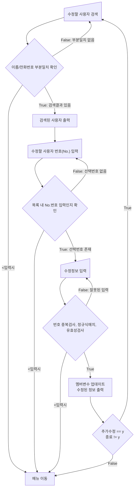

# 사용자 업데이트(수정)

```mermaid
flowchart 
    %%사용자 검색 노드
    update_search_name@{ shape: manual-input, label: "수정할 사용자 검색"}
    check_update_search_name{이름/전화번호 부분일치 확인}
    update_search_success[검색된 사용자 출력]

    %%사용자 선택 노드
    update_select@{ shape: manual-input, label: "수정할 사용자 번호(No.) 입력"}
    check_update_select{목록 내 No.번호 입력인지 확인}

    %%사용자 수정 노드
    update_input@{ shape: manual-input, label: "수정정보 입력"}
    check_update_input{번호 중복검사, 정규식매치, 유효성검사}
    check_update_success[멤버변수 업데이트<br>수정된 정보 출력]
    check_update_again{추가수정 == y<br>종료 != y}
    update_return_menu[메뉴 이동]
    

    %%사용자검색 흐름
    update_search_name --> check_update_search_name
    check_update_search_name --> |<입력시| update_return_menu
    check_update_search_name --> |False: 부분일치 없음| update_search_name
    check_update_search_name --> |True: 검색결과 있음| update_search_success

    %%사용자선택 흐름
    update_search_success --> update_select
    update_select --> check_update_select
    check_update_select --> |<입력시| update_return_menu
    check_update_select --> |False: 선택번호 없음| update_select
    check_update_select --> |True: 선택번호 존재| update_input

    %%수정 입력 흐릅
    update_input --> check_update_input
    check_update_input --> |<입력시| update_return_menu
    check_update_input --> |False: 잘못된 입력| update_input
    check_update_input --> |True| check_update_success

    %%추가 수정 흐름
    check_update_success --> check_update_again
    check_update_again -->|True| update_search_name
    check_update_again -->|False| update_return_menu
```
