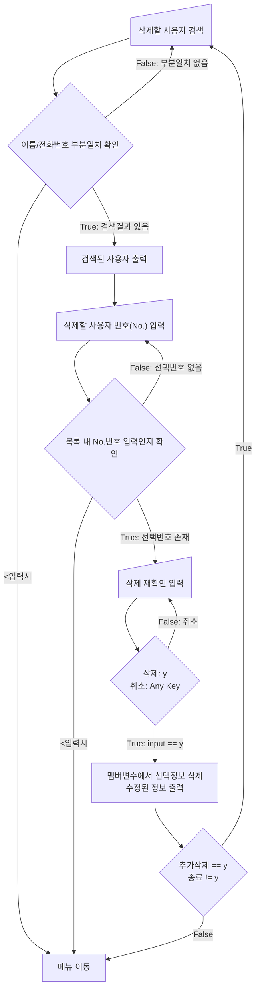

## 사용자 삭제

```mermaid
flowchart TD
    %%사용자 검색 노드
    delete_search_name@{ shape: manual-input, label: "삭제할 사용자 검색"}
    check_delete_search_name{이름/전화번호 부분일치 확인}
    delete_search_success[검색된 사용자 출력]

    %%사용자 선택 노드
    delete_select@{ shape: manual-input, label: "삭제할 사용자 번호(No.) 입력"}
    check_delete_select{목록 내 No.번호 입력인지 확인}

    %%사용자 삭제 노드
    delete_input@{ shape: manual-input, label: "삭제 재확인 입력"}
    check_delete_input{삭제: y<br>취소: Any Key }
    delete_input_success[멤버변수에서 선택정보 삭제<br>수정된 정보 출력]
    check_delete_again{추가삭제 == y<br>종료 != y}
    delete_return_menu[메뉴 이동]

    %%사용자검색 흐름
    delete_search_name --> check_delete_search_name
    check_delete_search_name --> |<입력시| delete_return_menu
    check_delete_search_name --> |False: 부분일치 없음| delete_search_name
    check_delete_search_name --> |True: 검색결과 있음| delete_search_success

    %%사용자선택 흐름
    delete_search_success --> delete_select
    delete_select --> check_delete_select
    check_delete_select --> |<입력시| delete_return_menu
    check_delete_select --> |False: 선택번호 없음| delete_select
    check_delete_select --> |True: 선택번호 존재| delete_input

    %%회원삭제 흐름
    delete_input --> check_delete_input
    check_delete_input --> |False: 취소| delete_input
    check_delete_input --> |True: input == y| delete_input_success
    delete_input_success --> check_delete_again
    check_delete_again -->|True| delete_search_name
    check_delete_again -->|False| delete_return_menu


```
