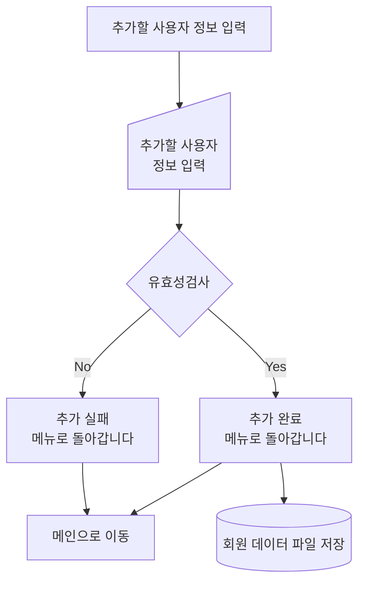

# 사용자 추가

```mermaid
flowchart TD 

    %% 추가할 사용자 정보입력, 유효성검사
    add_message[추가할 사용자 정보 입력]
    add_input@{ shape: manual-input, label: "추가할 사용자<br>정보 입력"}
    check_add_input{유효성검사}

    %% 검사 후 동작
    add_fail[추가 실패<br>메뉴로 돌아갑니다]
    add_success[추가 완료<br>메뉴로 돌아갑니다]
    save_file[(회원 데이터 파일 저장)]
    return_menu[메인으로 이동]

    add_message --> add_input
    add_input --> check_add_input
    check_add_input -->|No| add_fail
    check_add_input -->|Yes| add_success
    add_fail --> return_menu
    add_success --> save_file
    add_success --> return_menu

```