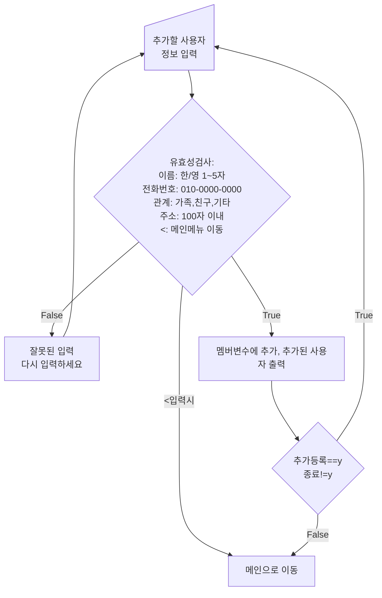

# 사용자 추가

```mermaid
flowchart TD

    %% 추가할 사용자 정보입력, 유효성검사
    add_input@{ shape: manual-input, label: "추가할 사용자<br>정보 입력"}
    check_add_input{유효성검사:<br>이름: 한/영 1~5자<br>전화번호: 010-0000-0000
                    관계: 가족,친구,기타<br> 주소: 100자 이내<br> <: 메인메뉴 이동}

    %% 검사 후 동작
    add_fail[잘못된 입력<br>다시 입력하세요]
    add_success[멤버변수에 추가, 추가된 사용자 출력]
    add_return_menu[메인으로 이동]
    check_add_again{추가등록==y<br>종료!=y}

    add_input --> check_add_input
    check_add_input -->|<입력시| add_return_menu
    check_add_input -->|True| add_success
    check_add_input -->|False| add_fail --> add_input
    add_success --> check_add_again
    check_add_again -->|True| add_input
    check_add_again -->|False| add_return_menu

```
