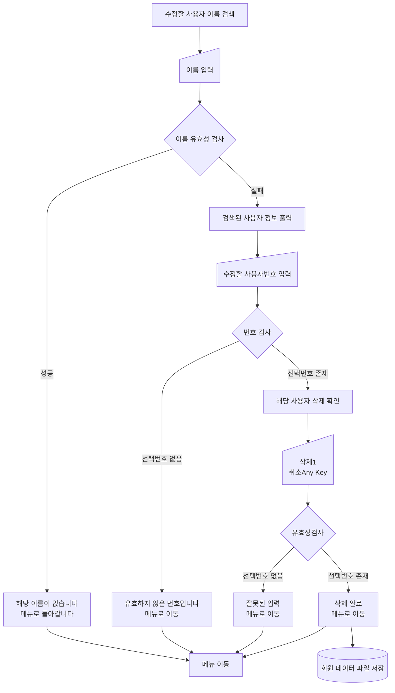

## 사용자 삭제

```mermaid
flowchart TD
    %%사용자 검색
    search_delete_message[수정할 사용자 이름 검색]
    search_name@{ shape: manual-input, label: "이름 입력"}
    check_search_name{이름 유효성 검사}
    search_fail[해당 이름이 없습니다<br>메뉴로 돌아갑니다]
    search_success[검색된 사용자 정보 출력]

    %%사용자 선택
    select_delete_message@{ shape: manual-input, label: "수정할 사용자번호 입력"}
    check_select_input{번호 검사}
    select_fail[유효하지 않은 번호입니다<br>메뉴로 이동]

    %%사용자 삭제
    delete_message[해당 사용자 삭제 확인]
    delete_input@{ shape: manual-input, label: "삭제1<br>취소Any Key"}
    check_delete_input{유효성검사}
    save_file[(회원 데이터 파일 저장)]
    delete_fail[잘못된 입력<br>메뉴로 이동]
    delete_success[삭제 완료<br>메뉴로 이동]
    return_menu[메뉴 이동]

    search_delete_message --> search_name
    search_name --> check_search_name
    check_search_name --> |성공| search_fail --> return_menu
    check_search_name --> |실패| search_success
    search_success --> select_delete_message
    select_delete_message --> check_select_input
    check_select_input --> |선택번호 없음| select_fail --> return_menu
    check_select_input --> |선택번호 존재| delete_message
    delete_message --> delete_input
    delete_input --> check_delete_input
    check_delete_input --> |선택번호 없음| delete_fail -->return_menu
    check_delete_input --> |선택번호 존재| delete_success -->return_menu
    delete_success --> save_file


```
