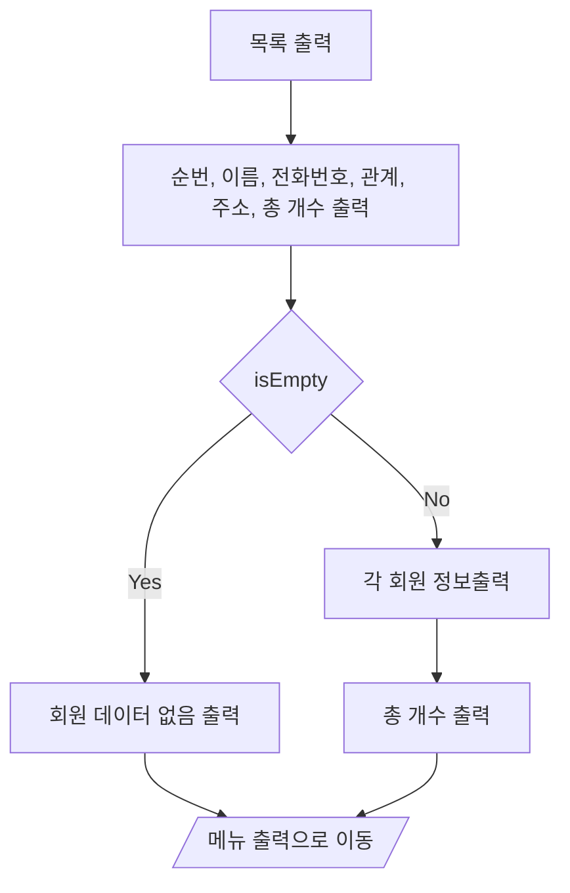

```mermaid
flowchart TD
    List[목록 출력] --> DataList[순번, 이름, 전화번호, 관계, 주소, 총 개수 출력]
    DataList --> CheckList{"isEmpty"}
    CheckList -->|Yes| EmptyMsg[회원 데이터 없음 출력]
    EmptyMsg --> ReturnMenu[/메뉴 출력으로 이동/]

    CheckList -->|No| LoopList[각 회원 정보출력]
    LoopList --> ShowCount[총 개수 출력]
    ShowCount --> ReturnMenu[/메뉴 출력으로 이동/]

```