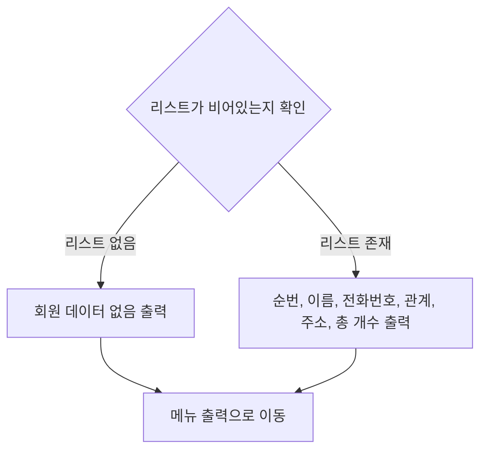

```mermaid
flowchart TD
    check_list{"리스트가 비어있는지 확인"}
    empty_msg[회원 데이터 없음 출력]
    return_menu[메뉴 출력으로 이동]
    data_list[순번, 이름, 전화번호, 관계, 주소, 총 개수 출력]

    check_list -->|리스트 없음| empty_msg
    empty_msg --> return_menu

    check_list -->|리스트 존재| data_list --> return_menu

```