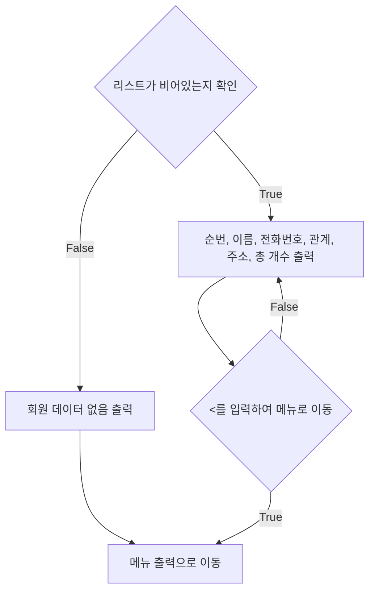

```mermaid
flowchart TD
    check_list{"리스트가 비어있는지 확인"}
    empty_msg[회원 데이터 없음 출력]
    data_list[순번, 이름, 전화번호, 관계, 주소, 총 개수 출력]
    check_return_menu_list{<를 입력하여 메뉴로 이동}
    return_menu[메뉴 출력으로 이동]


    check_list -->|False| empty_msg --> return_menu
    check_list -->|True| data_list --> check_return_menu_list
    check_return_menu_list-->|True| return_menu
    check_return_menu_list-->|False| data_list


```