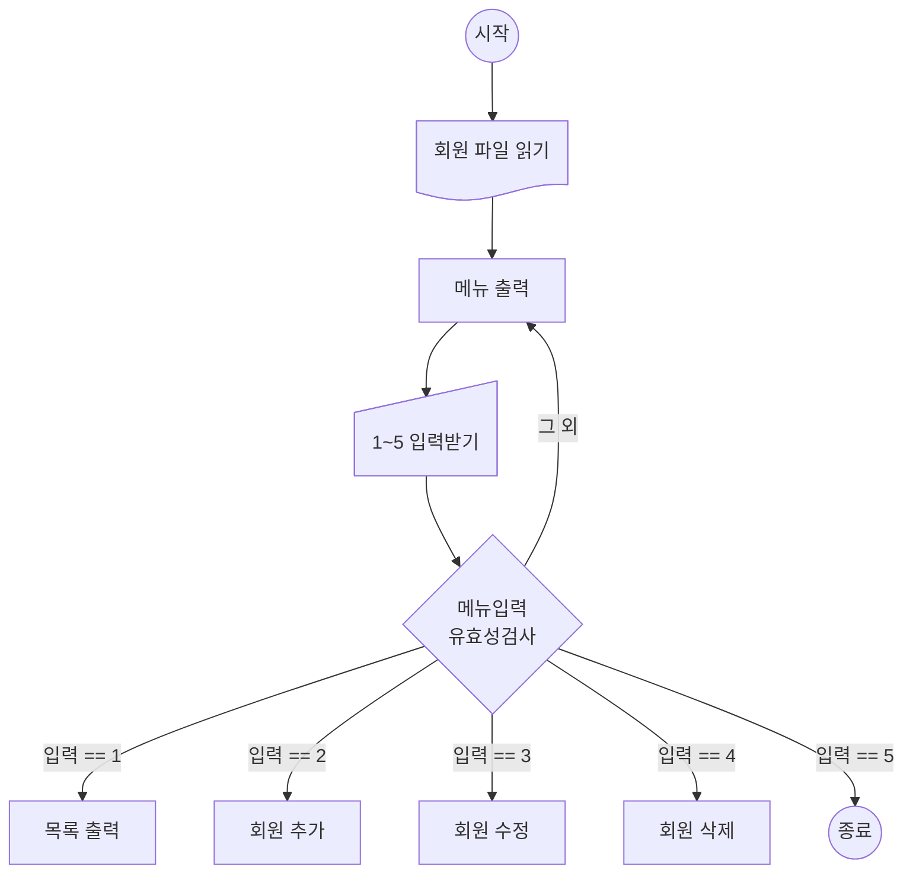

```mermaid
flowchart TD
    Start((시작))
    BinaryFile@{ shape: doc, label: "회원 파일 읽기" }
    Menu[메뉴 출력<br/>
            1.목록 출력  2.회원 추가<br/>  
            3.회원 수정  4. 회원 삭제<br/>
            5. 종료]
    InputName@{ shape: manual-input, label: "1~5 입력받기"}
    ChecktMenu{메뉴입력<br>유효성검사}
    Start --> BinaryFile
    BinaryFile --> Menu
    Menu --> InputName
    InputName --> ChecktMenu

    ChecktMenu -->|입력 == 1| List[목록 출력]
    ChecktMenu -->|입력 == 2| Add[회원 추가]
    ChecktMenu -->|입력 == 3| Update[회원 수정]
    ChecktMenu -->|입력 == 4| Remove[회원 삭제]
    ChecktMenu -->|입력 == 5| Finish((종료))
    ChecktMenu -->|그 외| Menu[메뉴 출력]
    
```
