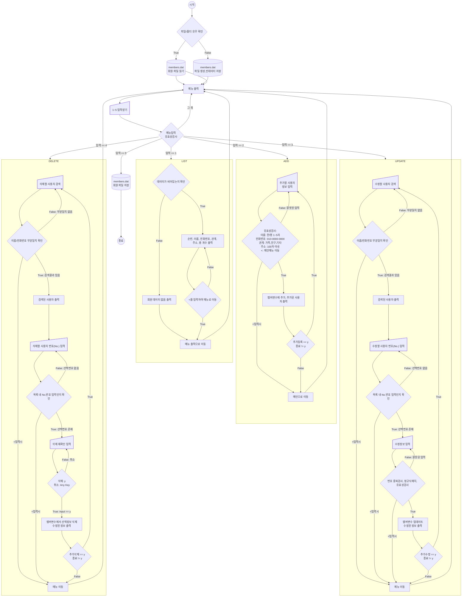

```mermaid
flowchart TD
%%메인메뉴 노드
    start((시작))
    read_binary_file@{ shape: database, label: "members.dat<br>회원 파일 읽기" }
    create_binary_file@{ shape: database, label: "members.dat<br>파일 생성,빈데이터 저장" }
    save_binary_file@{ shape: database, label: "members.dat<br>회원 파일 저장" }
    check_file{파일/폴더 유무 확인}
    menu[메뉴 출력<br/>
            1.목록 출력  2.회원 추가<br/>  
            3.회원 수정  4. 회원 삭제<br/>
            5. 종료]
    input_name@{ shape: manual-input, label: "1~5 입력받기"}
    check_input_menu{메뉴입력<br>유효성검사}

    subgraph LIST
    direction TB
        %% 회원정보 출력 노드  
        check_list{"데이터가 비어있는지 확인"}
        empty_msg[회원 데이터 없음 출력]
        data_list[순번, 이름, 전화번호, 관계, 주소, 총 개수 출력]
        check_return_menu_list{<를 입력하여 메뉴로 이동}
        return_menu[메뉴 출력으로 이동]

        %% 회원출력 흐름
        check_list -->|False| empty_msg --> return_menu
        check_list -->|True| data_list --> check_return_menu_list
        check_return_menu_list-->|True| return_menu
        check_return_menu_list-->|False| data_list
    end

    subgraph ADD
    direction TB
        %% 추가 정보입력 노드
        add_input@{ shape: manual-input, label: "추가할 사용자<br>정보 입력"}
        check_add_input{유효성검사:<br>이름: 한/영 1~5자<br>전화번호: 010-0000-0000
                        관계: 가족,친구,기타<br> 주소: 100자 이내<br> <: 메인메뉴 이동}

        %% 추가정보 검사 노드
        add_success[멤버변수에 추가, 추가된 사용자 출력]
        add_return_menu[메인으로 이동]
        check_add_again{추가등록 == y<br>종료 != y}

        %% 회원추가 흐름
        add_input --> check_add_input
        check_add_input -->|<입력시| add_return_menu
        check_add_input -->|True| add_success
        check_add_input -->|False: 잘못된 입력| add_input
        add_success --> check_add_again
        check_add_again -->|True| add_input
        check_add_again -->|False| add_return_menu
    end

    subgraph UPDATE
    direction TB
        %%사용자 검색 노드
        update_search_name@{ shape: manual-input, label: "수정할 사용자 검색"}
        check_update_search_name{이름/전화번호 부분일치 확인}
        update_search_success[검색된 사용자 출력]

        %%사용자 선택 노드
        update_select@{ shape: manual-input, label: "수정할 사용자 번호(No.) 입력"}
        check_update_select{목록 내 No.번호 입력인지 확인}

        %%사용자 수정 노드
        update_input@{ shape: manual-input, label: "수정정보 입력"}
        check_update_input{번호 중복검사, 정규식매치, 유효성검사}
        check_update_success[멤버변수 업데이트<br>수정된 정보 출력]
        check_update_again{추가수정 == y<br>종료 != y}
        update_return_menu[메뉴 이동]

        %%사용자검색 흐름
        update_search_name --> check_update_search_name
        check_update_search_name --> |<입력시| update_return_menu
        check_update_search_name --> |False: 부분일치 없음| update_search_name
        check_update_search_name --> |True: 검색결과 있음| update_search_success

        %%사용자선택 흐름
        update_search_success --> update_select
        update_select --> check_update_select
        check_update_select --> |<입력시| update_return_menu
        check_update_select --> |False: 선택번호 없음| update_select
        check_update_select --> |True: 선택번호 존재| update_input

        %%수정 입력 흐릅
        update_input --> check_update_input
        check_update_input --> |<입력시| update_return_menu
        check_update_input --> |False: 잘못된 입력| update_input
        check_update_input --> |True| check_update_success

        %%추가 수정 흐름
        check_update_success --> check_update_again
        check_update_again -->|True| update_search_name
        check_update_again -->|False| update_return_menu
    end

    subgraph DELETE
    direction TB
        %%사용자 검색 노드
        delete_search_name@{ shape: manual-input, label: "삭제할 사용자 검색"}
        check_delete_search_name{이름/전화번호 부분일치 확인}
        delete_search_success[검색된 사용자 출력]

        %%사용자 선택 노드
        delete_select@{ shape: manual-input, label: "삭제할 사용자 번호(No.) 입력"}
        check_delete_select{목록 내 No.번호 입력인지 확인}

        %%사용자 삭제 노드
        delete_input@{ shape: manual-input, label: "삭제 재확인 입력"}
        check_delete_input{삭제: y<br>취소: Any Key }
        delete_input_success[멤버변수에서 선택정보 삭제<br>수정된 정보 출력]
        check_delete_again{추가삭제 == y<br>종료 != y}
        delete_return_menu[메뉴 이동]

        %%사용자검색 흐름
        delete_search_name --> check_delete_search_name
        check_delete_search_name --> |<입력시| delete_return_menu
        check_delete_search_name --> |False: 부분일치 없음| delete_search_name
        check_delete_search_name --> |True: 검색결과 있음| delete_search_success

        %%사용자선택 흐름
        delete_search_success --> delete_select
        delete_select --> check_delete_select
        check_delete_select --> |<입력시| delete_return_menu
        check_delete_select --> |False: 선택번호 없음| delete_select
        check_delete_select --> |True: 선택번호 존재| delete_input

        %%회원삭제 흐름
        delete_input --> check_delete_input
        check_delete_input --> |False: 취소| delete_input
        check_delete_input --> |True: input == y| delete_input_success
        delete_input_success --> check_delete_again
        check_delete_again -->|True| delete_search_name
        check_delete_again -->|False| delete_return_menu
    end

    %% 프로그램 시작
    start --> check_file
    check_file --> |True| read_binary_file --> menu
    check_file --> |False| create_binary_file --> menu
    
    %% 데이터파일 로드
    read_binary_file --> menu
    menu --> input_name
    input_name --> check_input_menu

    %% 메뉴선택
    check_input_menu -->|입력 == 1| LIST
    check_input_menu -->|입력 == 2| ADD
    check_input_menu -->|입력 == 3| UPDATE
    check_input_menu -->|입력 == 4| DELETE
    check_input_menu -->|입력 == 5| save_binary_file --> finish((종료))
    check_input_menu -->|그 외| menu[메뉴 출력]

    return_menu -->menu
    add_return_menu -->menu
    update_return_menu -->menu
    delete_return_menu -->menu
```
