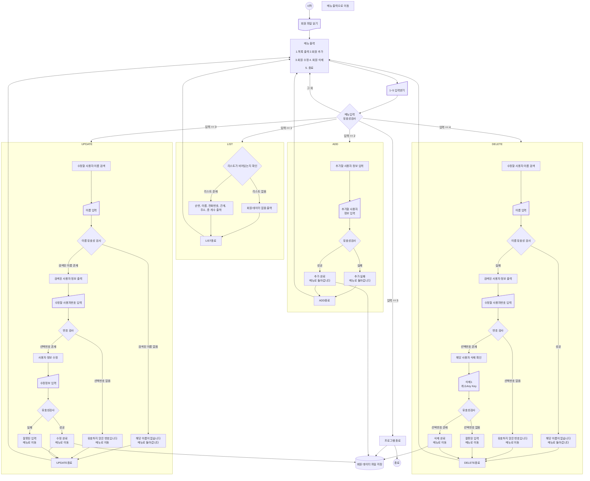

```mermaid
flowchart TD

%%  메인 플로우
    start((시작))
    binary_file@{ shape: doc, label: "회원 파일 읽기" }
    menu[메뉴 출력<br/>
        1.목록 출력  2.회원 추가<br/>
        3.회원 수정  4. 회원 삭제<br/>
        5. 종료]
    input_menu@{ shape: manual-input, label: "1~5 입력받기"}
    check_input_menu{메뉴입력<br>유효성검사}
    return_menu[메뉴 출력으로 이동]
    save_file[(회원 데이터 파일 저장)]
    exit_program[프로그램 종료]
%%  프로그램 시작
    start --> binary_file
    binary_file --> menu
    menu --> input_menu
    input_menu --> check_input_menu

%%  메뉴선택
    check_input_menu -->|그 외| menu
    check_input_menu -->|입력 == 1| LIST
    check_input_menu -->|입력 == 2| ADD
    check_input_menu -->|입력 == 3| UPDATE
    check_input_menu -->|입력 == 4| DELETE
    check_input_menu -->|입력 == 5| exit_program
    exit_program --> save_file
    exit_program --> finish((종료))

%%  1.목록출력
    subgraph LIST
    direction TB

    check_list{"리스트가 비어있는지 확인"}
    empty_msg[회원 데이터 없음 출력]
    data_list[순번, 이름, 전화번호, 관계, 주소, 총 개수 출력]
    exit_LIST[LIST종료]
    end

    check_list -->|리스트 없음| empty_msg --> exit_LIST
    check_list -->|리스트 존재| data_list --> exit_LIST


%%  2.회원추가
    subgraph ADD
    direction TB

    %% 추가할 사용자 정보입력, 유효성검사
    add_message[추가할 사용자 정보 입력]
    add_input@{ shape: manual-input, label: "추가할 사용자<br>정보 입력"}
    check_add_input{유효성검사}

    %% 검사 후 동작
    add_fail[추가 실패<br>메뉴로 돌아갑니다]
    add_success[추가 완료<br>메뉴로 돌아갑니다]
    exit_ADD[ADD종료]
    end

    add_message --> add_input
    add_input --> check_add_input
    check_add_input -->|실패| add_fail
    check_add_input -->|성공| add_success
    add_fail --> exit_ADD
    add_success --> save_file
    add_success --> exit_ADD


%%  3.회원 업데이트
    subgraph UPDATE
    direction TB

    %%사용자 검색
    search_update_message[수정할 사용자 이름 검색]
    search_update_name@{ shape: manual-input, label: "이름 입력"}
    check_search_up_name{이름 유효성 검사}
    search_update_fail[해당 이름이 없습니다<br>메뉴로 돌아갑니다]
    search_update_success[검색된 사용자 정보 출력]

    %%사용자 선택
    select_update_num@{ shape: manual-input, label: "수정할 사용자번호 입력"}
    check_select_update{번호 검사}
    select_update_fail[유효하지 않은 번호입니다<br>메뉴로 이동]

    %%사용자 정보 수정
    update_message[사용자 정보 수정]
    update_input@{ shape: manual-input, label: "수정정보 입력"}
    check_update_input{유효성검사}
    update_fail[잘못된 입력<br>메뉴로 이동]
    update_success[수정 완료<br>메뉴로 이동]
    exit_UPDATE[UPDATE종료]
    end

    search_update_message --> search_update_name
    search_update_name --> check_search_up_name
    check_search_up_name --> |검색된 이름 없음| search_update_fail --> exit_UPDATE
    check_search_up_name --> |검색된 이름 존재| search_update_success

    search_update_success --> select_update_num
    select_update_num --> check_select_update
    check_select_update --> |선택번호 없음| select_update_fail --> exit_UPDATE
    check_select_update --> |선택번호 존재| update_message
    update_message --> update_input
    update_input --> check_update_input
    check_update_input --> |실패| update_fail --> exit_UPDATE
    check_update_input --> |성공| update_success
    update_success --> save_file
    update_success --> exit_UPDATE


%%  4.회원 삭제
    subgraph DELETE
    direction TB

    %%사용자 검색
    search_delete_message[수정할 사용자 이름 검색]
    search_name@{ shape: manual-input, label: "이름 입력"}
    check_search_name{이름 유효성 검사}
    search_fail[해당 이름이 없습니다<br>메뉴로 돌아갑니다]
    search_success[검색된 사용자 정보 출력]

    %%사용자 선택
    select_delete_message@{ shape: manual-input, label: "수정할 사용자번호 입력"}
    check_select_input{번호 검사}
    select_fail[유효하지 않은 번호입니다<br>메뉴로 이동]

    %%사용자 삭제
    delete_message[해당 사용자 삭제 확인]
    delete_input@{ shape: manual-input, label: "삭제1<br>취소Any Key"}
    check_delete_input{유효성검사}
    delete_fail[잘못된 입력<br>메뉴로 이동]
    delete_success[삭제 완료<br>메뉴로 이동]
    exit_DELETE[DELETE종료]
    end

    search_delete_message --> search_name
    search_name --> check_search_name
    check_search_name --> |성공| search_fail --> exit_DELETE
    check_search_name --> |실패| search_success
    search_success --> select_delete_message
    select_delete_message --> check_select_input
    check_select_input --> |선택번호 없음| select_fail --> exit_DELETE
    check_select_input --> |선택번호 존재| delete_message
    delete_message --> delete_input
    delete_input --> check_delete_input
    check_delete_input --> |선택번호 없음| delete_fail -->exit_DELETE
    check_delete_input --> |선택번호 존재| delete_success
    delete_success --> save_file
    delete_success --> exit_DELETE

    exit_LIST-->menu
    exit_ADD-->menu
    exit_UPDATE-->menu
    exit_DELETE-->menu
```
