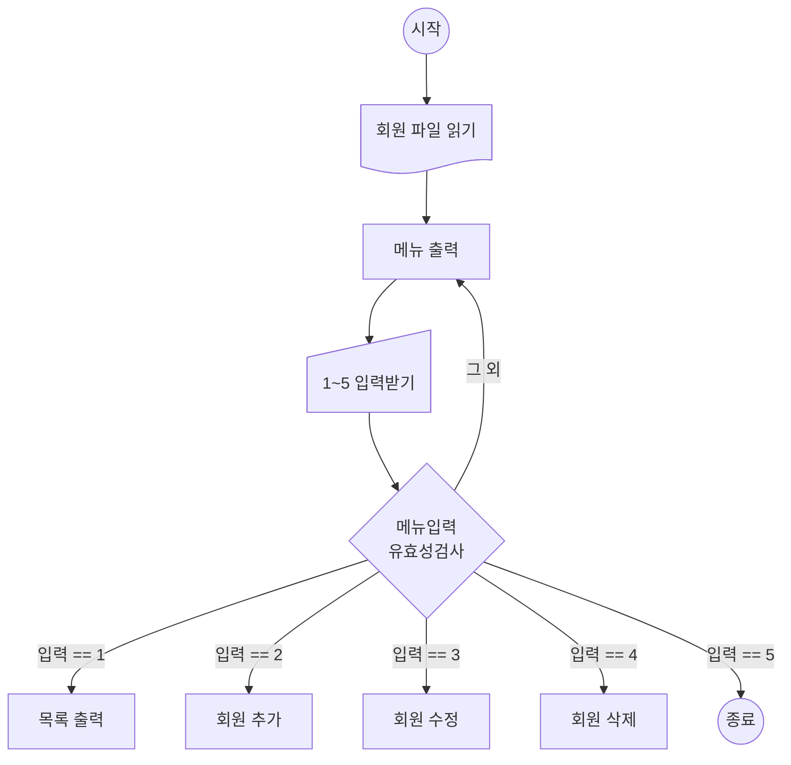

```mermaid
flowchart TD
    start((시작))
    binary_file@{ shape: doc, label: "회원 파일 읽기" }
    menu[메뉴 출력<br/>
            1.목록 출력  2.회원 추가<br/>  
            3.회원 수정  4. 회원 삭제<br/>
            5. 종료]
    input_name@{ shape: manual-input, label: "1~5 입력받기"}
    check_input_menu{메뉴입력<br>유효성검사}
    start --> binary_file
    binary_file --> menu
    menu --> input_name
    input_name --> check_input_menu

    check_input_menu -->|입력 == 1| list[목록 출력]
    check_input_menu -->|입력 == 2| add[회원 추가]
    check_input_menu -->|입력 == 3| update[회원 수정]
    check_input_menu -->|입력 == 4| remove[회원 삭제]
    check_input_menu -->|입력 == 5| finish((종료))
    check_input_menu -->|그 외| menu[메뉴 출력]
    
```
