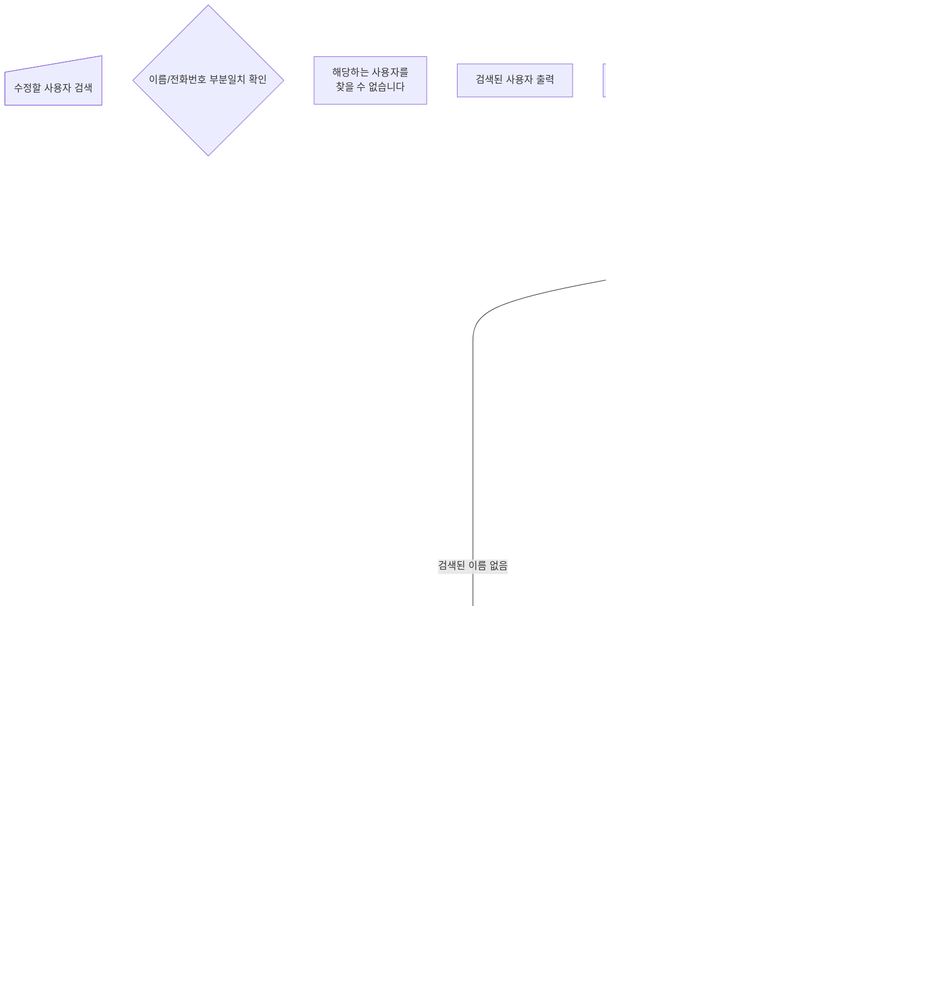

# 사용자 업데이트(수정)

```mermaid
flowchart 

    %%사용자 검색
    update_search_name@{ shape: manual-input, label: "수정할 사용자 검색"}
    check_update_search_name{이름/전화번호 부분일치 확인}
    update_search_fail[해당하는 사용자를<br>찾을 수 없습니다]
    update_search_success[검색된 사용자 출력]

    %%사용자 선택
    select@{ shape: manual-input, label: "수정할 사용자번호 입력"}
    check_select{번호 검사}
    select_fail[유효하지 않은 번호입니다<br>메뉴로 이동]

    %%사용자 정보 수정
    update_message[사용자 정보 수정]
    update_input@{ shape: manual-input, label: "수정정보 입력"}
    check_update_input{유효성검사}
    save_file[(회원 데이터 파일 저장)]
    update_fail[잘못된 입력<br>메뉴로 이동]
    update_success[수정 완료<br>메뉴로 이동]
    return_menu[메뉴 이동]


    search_update_message --> search_name
    search_name --> check_search_name
    check_search_name --> |검색된 이름 없음| search_fail --> return_menu
    check_search_name --> |검색된 이름 존재| search_success

    search_success --> select
    select --> check_select
    check_select --> |선택번호 없음| select_fail --> return_menu
    check_select --> |선택번호 존재| update_message
    update_message --> update_input
    update_input --> check_update_input
    check_update_input --> |실패| update_fail --> return_menu
    check_update_input --> |성공| update_success --> return_menu
    update_success --> save_file

```
