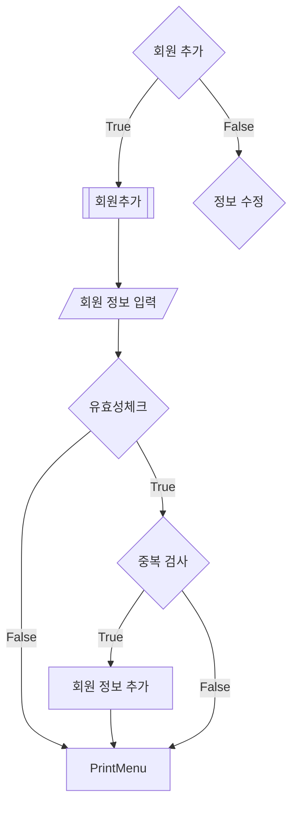

```mermaid
graph TD
Select2{회원 추가} -->|True| AddInfo[[회원추가]] --> InputInfo2[/회원 정보 입력/] --> InputValidCheck2{유효성체크}
Select2 -->|False| Select3{정보 수정}

InputValidCheck2 -->|True| DuplicateCheck1{중복 검사}
InputValidCheck2 -->|False| PrintMenu

DuplicateCheck1 -->|True| InsertData[회원 정보 추가] --> PrintMenu
DuplicateCheck1 -->|False| PrintMenu
```