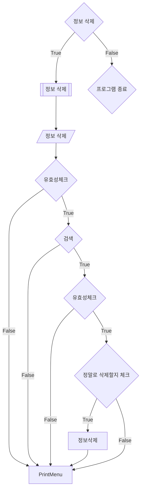

```mermaid
graph TD
Select4{정보 삭제} -->|True| DeleteInfo[[정보 삭제]] --> InputDeleteMember[/정보 삭제/] --> InputMemberValidCheck2{유효성체크}
Select4 -->|False| Select5{프로그램 종료}

InputMemberValidCheck2 -->|True| Search2{검색}
InputMemberValidCheck2 -->|False| PrintMenu

Search2 -->|True| InputValidCheck4{유효성체크}
Search2 -->|False| PrintMenu

InputValidCheck4 -->|True| CheckAsk1{정말로 삭제할지 체크}
InputValidCheck4 -->|False| PrintMenu

CheckAsk1 -->|True| DeleteData[정보삭제] --> PrintMenu
CheckAsk1 -->|False| PrintMenu
```