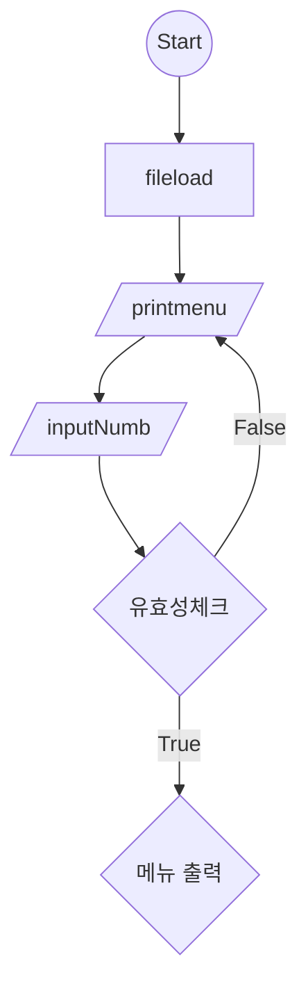

```mermaid
graph TD
Start((Start)) --> FileLoad[fileload] --> PrintMenu[/printmenu/] --> InputNumb[/inputNumb/] --> ValidCheck{유효성체크}
ValidCheck -->|True| Select1{메뉴 출력}
ValidCheck -->|False| PrintMenu
```