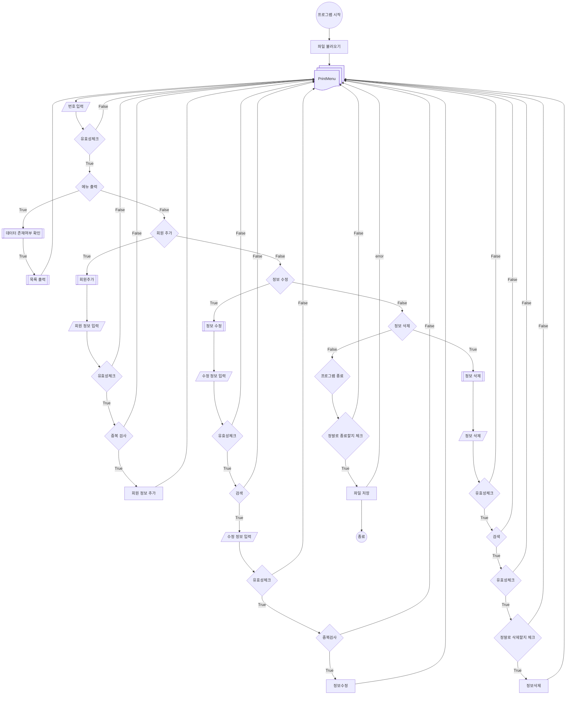

```mermaid
graph TD

%% 시작 및 초기 로딩
Start((프로그램 시작)) --> FileLoad[파일 불러오기] --> PrintMenu@{ shape: docs, label:"메뉴 출력"} --> InputNumb[/번호 입력/] --> ValidCheck{유효성체크}

%% 메뉴 선택 분기
ValidCheck -->|True| Select1{메뉴 출력}
ValidCheck -->|False| PrintMenu

%% 1번 선택: 목록 출력
Select1 -->|True| DataExist[[데이터 존재여부 확인]]-->|True| PrintList[[목록 출력]] --> PrintMenu
Select1 -->|False| Select2{회원 추가}

%% 2번 선택: 정보 추가
Select2 -->|True| AddInfo[[회원추가]] --> InputInfo2[/회원 정보 입력/] --> InputValidCheck2{유효성체크}
Select2 -->|False| Select3{정보 수정}

InputValidCheck2 -->|True| DuplicateCheck1{중복 검사}
InputValidCheck2 -->|False| PrintMenu

DuplicateCheck1 -->|True| InsertData[회원 정보 추가] --> PrintMenu
DuplicateCheck1 -->|False| PrintMenu

%% 3번 선택: 정보 수정
Select3 -->|True| UpdateInfo[[정보 수정]] --> InputSearchMember[/수정 정보 입력/] --> InputMemberValidCheck1{유효성체크}
Select3 -->|False| Select4{정보 삭제}

InputMemberValidCheck1 -->|True| Search1{검색}
InputMemberValidCheck1 -->|False| PrintMenu

Search1 -->|True| InputInfo3[/수정 정보 입력/] --> InputValidCheck3{유효성체크}
Search1 -->|False| PrintMenu

InputValidCheck3 -->|True| DuplicateCheck2{중복검사}
InputValidCheck3 -->|False| PrintMenu

DuplicateCheck2 -->|True| UpdateData[정보수정] --> PrintMenu
DuplicateCheck2 -->|False| PrintMenu

%% 4번: 정보 삭제
Select4{정보 삭제}
DeleteInfo[[정보 삭제]]
InputDeleteMember[/정보 삭제/]
InputMemberValidCheck2{유효성체크}
Search2{검색}
InputValidCheck4{유효성체크}
CheckAsk1{정말로 삭제할지 체크}
DeleteData[정보삭제]

Select4 -->|True| DeleteInfo --> InputDeleteMember --> InputMemberValidCheck2
InputMemberValidCheck2 -->|True| Search2
InputMemberValidCheck2 -->|False| PrintMenu

Search2 -->|True| InputValidCheck4
Search2 -->|False| PrintMenu

InputValidCheck4 -->|True| CheckAsk1
InputValidCheck4 -->|False| PrintMenu

CheckAsk1 -->|True| DeleteData --> PrintMenu
CheckAsk1 -->|False| PrintMenu

Select4 -->|False| Select5

%% 5번: 프로그램 종료
Select5{프로그램 종료}
CheckAsk{정말로 종료할지 체크}
SaveFile[파일 저장]
End((종료))

Select5 --> CheckAsk
CheckAsk -->|True| SaveFile --> End
CheckAsk -->|False| PrintMenu
SaveFile -->|error| PrintMenu
```