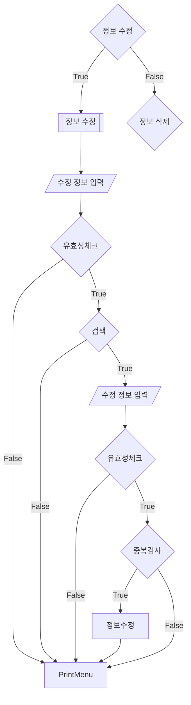

```mermaid
graph TD
Select3{정보 수정} -->|True| UpdateInfo[[정보 수정]] --> InputSearchMember[/수정 정보 입력/] --> InputMemberValidCheck1{유효성체크}
Select3 -->|False| Select4{정보 삭제}

InputMemberValidCheck1 -->|True| Search1{검색}
InputMemberValidCheck1 -->|False| PrintMenu

Search1 -->|True| InputInfo3[/수정 정보 입력/] --> InputValidCheck3{유효성체크}
Search1 -->|False| PrintMenu

InputValidCheck3 -->|True| DuplicateCheck2{중복검사}
InputValidCheck3 -->|False| PrintMenu

DuplicateCheck2 -->|True| UpdateData[정보수정] --> PrintMenu
DuplicateCheck2 -->|False| PrintMenu
```